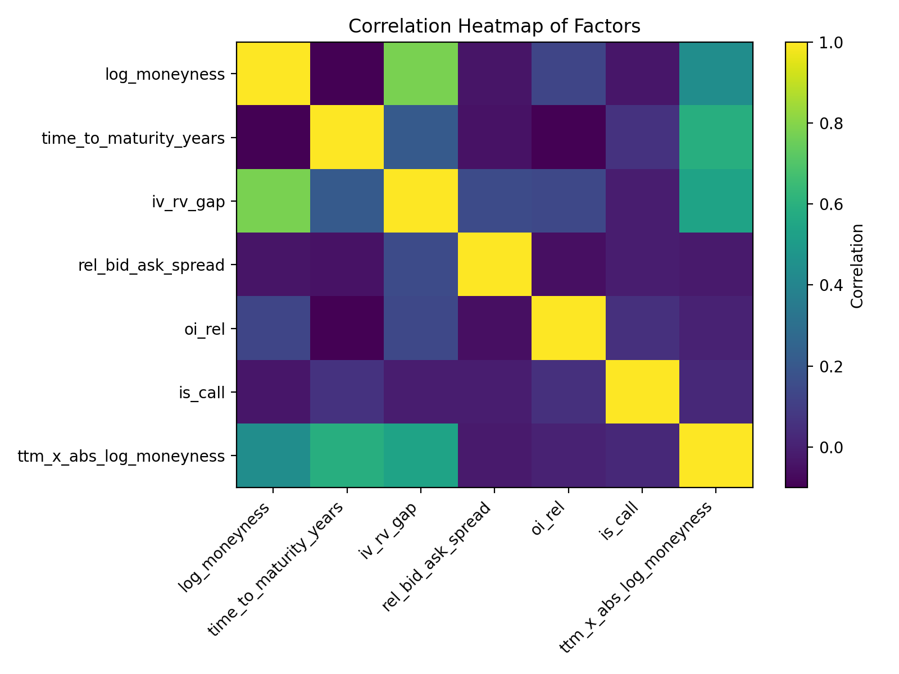
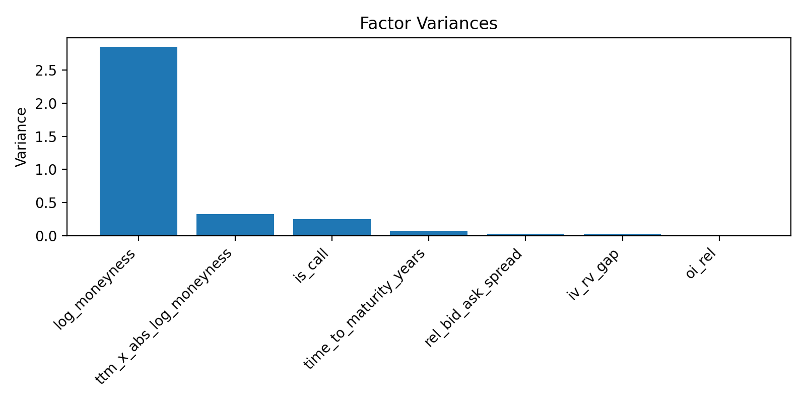
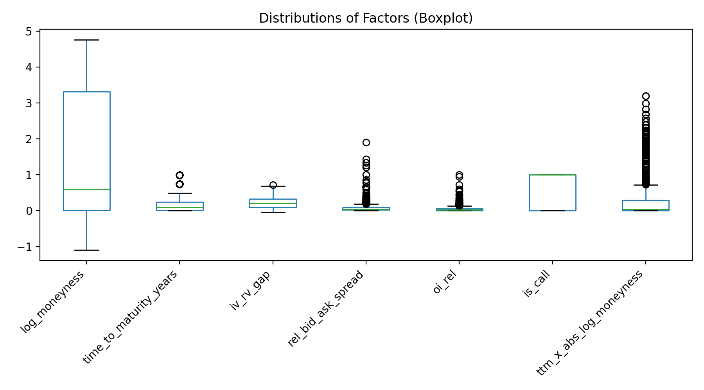

# Анализ факторов отклонения цен опционов от модели Блэка–Шоулза

## 1. Цель и постановка задачи

Цель проекта — **эмпирически исследовать факторы, влияющие на отклонения рыночных цен опционов от теоретических значений, рассчитанных по модели Блэка–Шоулза–Мертона (Black–Scholes–Merton, BSM)**.

Задачи исследования:
- сформировать кросс-секцию цен опционов на фиксированный момент времени;
- вычислить теоретические цены опционов по модели BSM;
- сконструировать экономически осмысленный набор факторов (регрессоров), не содержащий линейно-зависимых координат;
- оценить регрессионную модель логарифмической ошибки ценообразования;
- интерпретировать вклад каждого фактора с точки зрения финансовой теории и рыночных фрикций.

---

## 2. Данные и источники

- **Источник котировок и сделок:** агрегатор **Tardis.dev** (исторические нормализованные данные).  
- **Площадки:** OKX (options, spot, perpetual swaps) и Binance (spot, USDT-margined futures).  
- **Базовый актив:** Bitcoin (BTC-USDT / BTCUSDT).  
- **Дата и время snapshot:** **2024-10-01 12:00:00 UTC**.  
- **Тип данных:** опционы, спот и бессрочные фьючерсы, используемые для расчёта опорной цены и реализованной волатильности.

Построение кросс-секции реализовано в скрипте:
`scripts/tardis_okx_binance_cross_section.py`  
Результирующий файл: `data/okx_binance_options_cross_section_20241001_120000+0000.csv`

---

## 3. Теоретическая основа

### 3.1. Модель Блэка–Шоулза–Мертона

Цена европейского call-опциона:

$$
C = S_0 N(d_1) - K e^{-rT} N(d_2),
$$

где

$$
d_1 = \frac{\ln(S_0 / K) + (r + \sigma^2 / 2)T}{\sigma \sqrt{T}}, \quad
d_2 = d_1 - \sigma \sqrt{T}.
$$

а $S_0$ — цена базового актива, $K$ — страйк, $T$ — время до экспирации,  
$r$ — безрисковая ставка, $\sigma$ — волатильность, $N(\cdot)$ — стандартная нормальная функция распределения.

Для put-опциона:

$$
P = K e^{-rT} N(-d_2) - S_0 N(-d_1).
$$

### 3.2. Мера отклонения (mispricing)

Зависимая переменная — логарифмическая ошибка между рыночной и модельной ценой:

$$
bsm\_error\_log = \ln\!\left( \frac{P_{\text{mkt}}}{P_{\text{BSM}}} \right),
$$

где $P_{\text{mkt}}$ — рыночная цена опциона, $P_{\text{BSM}}$ — теоретическая цена по модели BSM.

Интерпретация:
- $bsm\_error\_log > 0$ — опцион переоценён относительно модели BSM;  
- $bsm\_error\_log < 0$ — опцион недооценён.

Дополнительно рассчитывались меры:

$$
bsm\_error\_rel = \frac{P_{\text{mkt}} - P_{\text{BSM}}}{P_{\text{BSM}}}, \quad
bsm\_error\_raw = P_{\text{mkt}} - P_{\text{BSM}}.
$$

---

## 4. Формирование факторов

Кросс-секция строится на один фиксированный snapshot. Для каждого опциона рассчитываются:

1. **Опорная цена базового актива**

$$S_{\text{ref}}=\frac{S_{\text{OKX}}^{\text{spot}}+S_{\text{Binance}}^{\text{spot}}}{2}$$

2. **Log-moneyness**

$$log\_moneyness=\ln\!\left(\frac{S_{\text{ref}}}{K}\right)$$

3. **Срок до экспирации**

$$time\_to\_maturity\_years=T=\frac{\text{expiry}-\text{snapshot}}{365}$$

4. **Разрыв IV–RV**

$$iv\_rv\_gap=IV_{\text{mark}}-RV_{\text{14d}}$$

где $RV_{\text{14d}}$ — реализованная годовая волатильность BTCUSDT за 14 дней до snapshot.

5. **Относительный bid-ask спред**

$$rel\_bid\_ask\_spread=\frac{ask-bid}{mid}$$

6. **Нормированный open interest**

$$oi\_rel=\frac{OI_i}{\max_j OI_j}$$

7. **Нелинейное взаимодействие глубины и срока**

$$ttm\_x\_abs\_log\_moneyness=T\cdot\left|\ln\left(\frac{S_{ref}}{K}\right)\right|$$

8. **Dummy-переменная типа опциона**  
`is_call = 1` для call-опционов, `0` — для put-опционов.
---

## 5. Разведочный анализ данных (EDA)

**Основные наблюдения:**  
- корреляция `log_moneyness` и `iv_rv_gap` указывает на эффект улыбки волатильности;  
- остальные факторы мультиколлинеарностью не страдают;  
- дисперсии всех факторов положительны.

---

## 6. Регрессионная модель

### 6.1. Спецификация

$$
bsm\_error\_log_{i}=\beta_{0}+\beta_{1}\,log\_moneyness_{z,i}+\beta_{2}\,time\_to\_maturity\_years_{z,i}+\beta_{3}\,iv\_rv\_gap_{z,i}+\beta_{4}\,log\_rel\_bid\_ask\_spread_{z,i}+\beta_{5}\,oi\_rel_{z,i}+\beta_{6}\,ttm\_x\_abs\_log\_moneyness_{z,i}+\beta_{7}\,is\_call_{i}+\varepsilon_{i}
$$

Где:
- непрерывные факторы стандартизированы (z-score);  
- оценивание: **OLS + робастные стандартные ошибки HC3**;  
- зависимая переменная: `bsm_error_log`.

---

## 7. Интерпретация результатов

- **log_moneyness_z** — положительный и значимый: эффект улыбки волатильности;  
- **iv_rv_gap_z** — положительный: премия за риск волатильности;  
- **log_rel_bid_ask_spread_z** — положительный: менее ликвидные опционы переоценены;  
- **time_to_maturity_years_z** — отрицательный: mispricing снижается для долгосрочных контрактов;  
- **oi_rel_z** — отрицательный: ликвидные страйки ближе к равновесию;  
- **ttm_x_abs_log_moneyness_z** — подтверждает нелинейную зависимость глубины и срока;  
- **is_call** — отражает асимметрию между CALL и PUT.

---

## 8. Выводы

1. Модель Блэка–Шоулза не полностью описывает рынок криптоопционов.  
2. Mispricing объясняется структурой moneyness, разрывом IV–RV и ликвидностью.  
3. Полученные результаты соответствуют теории рыночных фрикций и волатильностных премий.  
4. Разработанный пайплайн можно масштабировать для панельного анализа.

---

## 9. Список литературы

1. Black, F., & Scholes, M. (1973). *The Pricing of Options and Corporate Liabilities.* Journal of Political Economy, 81(3), 637–654.  
2. Merton, R. C. (1973). *Theory of Rational Option Pricing.* Bell Journal of Economics, 4(1), 141–183.  
3. Hull, J. C. (2018). *Options, Futures, and Other Derivatives.* Pearson.  
4. Bakshi, G., Kapadia, N., & Madan, D. (2003). *Stock Return Characteristics, Skew Laws, and the Differential Pricing of Individual Equity Options.* Review of Financial Studies, 16(1), 101–143.  
5. Christensen, B. J., & Prabhala, N. R. (1998). *The Relation between Implied and Realized Volatility.* Journal of Financial Economics, 50(2), 125–150.
